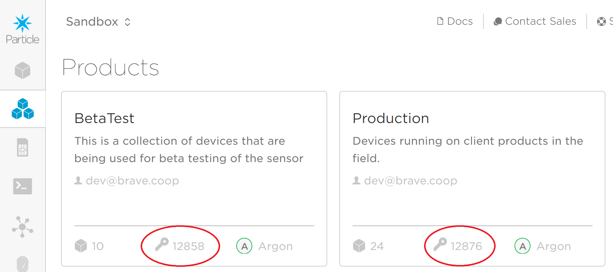

# SensorProductionFirmware

Last update to this readme: Apr 7/21

This Repository approximately follows the gitflow workflow method, see the [tutorial](https://www.atlassian.com/git/tutorials/comparing-workflows/gitflow-workflow)  It does not use a Develop branch, however; this repo only contains the main (master) branch, Release branch, and feature branches.

Tags denote the different releases pushed to the master branch.  

As of Apr 7/21, the different product firmware versions in this repo are:

2 Argon + XeThru - in the main (master) branch.
2 Argon + INS - in the Release branch.
1 Boron + INS - in the Local-State-Machine branch.


## Table of Contents

1. [Table of Contents](#table-of-contents)
2. [Firmware Versioning](#firmware-versioning)
3. [Two Argon and XeThru Firmware](#two-argon-and-xethru-firmware)
      - [Firmware Settings and Config](#firmware-settings-and-config)
        - [DEBUG_LEVEL](#debug_level)
        - [IM21_PARTICLE](#im21_particle)
        - [XETHRU_PARTICLE](#xethru_particle)
        - [PHOTON](#photon)
        - [BRAVE_FIRMWARE_VERSION](#brave_firmware_version)
        - [PRODUCT_ID_BETATEST and PRODUCT_ID_PRODUCTION](#product_id_betatest-and-product_id_production)
        - [Wifi Settings](#wifi-settings)
        - [locationID, deviceID, devicetype](#locationID,-deviceID,-devicetype)
        - [XeThru Configuration Variables](#xethru-configuration-variables)
        - [IM21 Door Sensor Settings](#im21-door-sensor-settings)

      - [Console Function Instructions](#console-function-instructions)
          - [ChangeSSID(String)](#changessid(string))
          - [ChangePwd(String)](#changepwd(string))
          - [getWifiLog(String)](#getwifilog(string))
          - [changeIM21DoorID(String)](#changeim21doorid(string))
          - [changeXeThruConfigVals(String)](#changexethruconfigvals(string))

      - [Published Events](#published-events)
          - [XeThru](#xethru)
          - [XeThru Error](#xethru-error)
          - [Current Xethru Config Settings](#current-xethru-config-settings)
          - [Current SSIDs](#current-ssids)
          - [Current wifi passwords](#current-wifi-passwords)
          - [WiFi Disconnect Warning](#wifidisconnectwarning)
          - [IM21 Data](#im21-data)
          - [IM21 Warning](#im21-warning)
          - [Current Door Sensor ID](#current-door-sensor-id)
          - [spark/device/diagnostics/update](#spark/device/diagnostics/update)
4. [Two Argons and INS Firmware](#two-argons-and-ins-firmware)
      - [Firmware Settings](#firmware-settings)
        - [INS3331_PARTICLE](#ins3331_particle)
      - [Console Function Instructions](#console-function-instructions)
      - [Published Events](#published-events)
          - [INS3331 Data](#ins3331-data)
5. [Single Boron Firmware State Machine](#single-boron-firmware-state-machine)
      - [Firmware State Machine Setup](#firmware-state-machine-setup)
      - [Important Constants and Settings](#important-constants-and-settings)
          - [DEBUG_LEVEL](#debug_level)
          - [BRAVE_FIRMWARE_VERSION: state machine](#brave_firmware_version:-state-machine)
          - [PRODUCT_ID_BETATEST and PRODUCT_ID_PRODUCTION: state machine](#product_id_betatest-and-product_id_production:-state-machine)
          - [INS_THRESHOLD](#ins_threshold)
          - [STATE1_MAX_TIME](#state1_max_time)
          - [STATE2_MAX_DURATION](#state2_max_duration)
          - [STATE3_MAX_STILLNESS_TIME](#state3_max_stillness_time)
          - [DEBUG_PUBLISH_INTERVAL](#debug_publish_interval)
          - [SM_HEARTBEAT_INTERVAL](#sm_heartbeat_interval)
          - [MOVING_AVERAGE_SAMPLE_SIZE](#moving_average_sample_size)
          - [MOVING_AVERAGE_BUFFER_SIZE](#moving_average_buffer_size)
          - [Door Sensor Definitions](#door-sensor-definitions)
      - [State Machine Console Functions](#state-machine-console-functions)
          - [stillness_timer_set(String)](#stillness_timer_set(String))
          - [initial_timer_set(String)](#initial_timer_set(String))
          - [duration_timer_set(String)](#duration_timer_set(String))
          - [ins_threshold_set(String)](#ins_threshold_set(String))
          - [toggle_debugging_publishes(String)](#toggle_debugging_publishes(String))
          - [im21_door_id_set(String)](#im21_door_id_set(String))
      - [State Machine Published Messages](#state-machine-published-messages)
          - [Stillness Alert](#stillness-alert)
          - [Heartbeat Message](#heartbeat-message)
          - [Debug Message](#debug-message)
          - [Debugging: State Transition](#debugging:-state-transition)
          - [Current Door Sensor ID](#current-door-sensor-id)
          - [spark/device/diagnostics/update](#spark/device/diagnostics/update)
6. [Webhook Templates](#webhook-templates)
    - [XeThru Template](#xethru-template)
    - [IM21 Template](#im21-template)
    - [INS3331 Template](#ins3331-template)


## Firmware Versioning

Unfortunately current versioning is quite complicated, especially because version numbers on the Particle console are limited to single ints and thus cannot match the versioning we've established in the firmware repo tags.  Versioning should become much simpler when the 2 Argon + Radar products are depreciated.  

In the master (main) branch, in the firmware_config.h file, the comments contain the most up to date firmware versioning history.  As of Apr 7/21, this is as follows:

* v1.0 = Wayne and Sanjan's code is v1 on the Particle console, although this is depreciated now.
* v1.2 = 2 Argon + XeThru code:  the XeThru Argon's version of the firmware is v3 on the particle console, and the door sensor Argon's firmware is v4
* v1.2.01 and v1.2.02 are hotfixes, and their console versions increment accordingly:
  * v1.2.01: XeThru = 5, IM21 = 6
  * v1.2.02: Xethru = 7, IM21 = 8
* The custom firmware on the Covenant House Door Argons is version #101 on the console.
* Beta release versions for the 2 Argon + INS follow the same numbering scheme of odd for radar Argon and even for Door Argon, except the numbers start at 1001.  There are no tags in the firmware repo since this version has not been released to production yet.
* State machine beta release will start at #2000 on the Particle Console. There are no corresponding repo tags/versions since this code has not been released to production yet

## Two Argon and XeThru Firmware

As of Apr 7/21, this firmware is in the main (master) branch, and is in production on the devices at client sites.

### Firmware Settings and Config

Setup firmware must be flashed to these devices before the production firmware can be flashed to them.  Setup firmware is found in the Setup-Firmware branch.  Step-by-step instructions on how to flash this and the production firmware are shared with developers internally.

The production firmware also has configuration values, found in the firmware_config.h file.  

See the list below for information on the settings found in these two files:

#### DEBUG_LEVEL

Define this in both the setup and production firmware config files.

The debug level controls which statements the Particle OS's log handler will print.  The levels in decending order from most to least detailed are: trace, info, warn, error.  Further information can be found [here](https://docs.particle.io/reference/device-os/firmware/argon/#logging)

This firmware defaults to warn level.  If more detailed debugging info is needed, eg for clients that have difficulting remaining connected to wifi, it can be set to info.  

If you are connect to the Particle device via USB, these logs can be read by opening a Particle [command line interface](https://docs.particle.io/reference/developer-tools/cli/) and using the command "particle serial monitor --follow".

#### IM21_PARTICLE

Uncomment this define in both the setup and production firmware config files if you are flashing code to an IM21 Particle device (an Argon as of the date of this writing).

An “IM21 Particle” connects to the IM21 door sensor via bluetooth low energy, and relays door open/door closed events to the cloud.  Defining IM21_PARTICLE will enable the IM21 door sensor code for compilation/flashing to a Particle.

Do not define XETHRU_PARTICLE at the same time unless you want both the door sensor and the Xethru breath sensor to be operated by the same Particle.  This is not advisable as door open/closed events will be dropped.

#### XETHRU_PARTICLE

Uncomment this define in both the setup and production firmware config files if you are flashing code to a XeThru Particle device (an Argon as of the date of this writing).

A “Xethru Particle” connects to the Xethru radar sensor and relays radar data to the cloud.  Defining XETHRU_PARTICLE will enable the xethru sensor firmware for compilation/flashing to a Particle.

Do not define IM21_PARTICLE at the same time unless you want both the door sensor and the Xethru breath sensor to be operated by the same Particle.  This is not advisable as door open/closed events will be dropped.

#### PHOTON

Define this in the production firmware config file if your device is a photon, so photon-specific code can be compiled/flashed. The default device is currently an Argon.  (Presently all this macro does is turn on the Photon’s external wifi antenna, all other code is identical to the Argon.)

#### BRAVE_FIRMWARE_VERSION

Define this in the production firmware's config file.

This is the version number of the firmware that the Particle Console will use to determine which devices to flash.  It must be an int.  Due to this restriction versioning is a bit complicated, see the section on [versioning](#firmware-versioning).

#### PRODUCT_ID_BETATEST and PRODUCT_ID_PRODUCTION

Define one of these in the production firmware's config file, depending on whether your firmware is going to the beta test group or the production group on the Particle Console.

These are the product keys that the Particle OS requires.  They define which product group the device belongs to.  Fleetwide OTA updates of firmware are tied to product groups.  The firmware that is flashed to devices in the beta test group must contain the Particle console's key for that group, ditto for the production group and any other groups created in the future.

Product keys are found by looking at the list of different products on the Particle console:



For more information on fleetwide updates, see the Particle docs [here](https://docs.particle.io/tutorials/device-cloud/ota-updates/#fleet-wide-ota).

#### Wifi Settings

In this section you define client wifi credentials, and two internal Brave passwords that can be entered to the Particle console functions to publish credentials in flash memory.  

**Always use `“”` string quotes to indicate string format.  Do not leave any define blank in this section or the code will break.**

Define the CLIENTSSIDX and CLIENTPWDX macros to the client wifi credentials, where X is the index number of the wifi/password pair.

SSID/password pairs share a common index number.  For example, CLIENTPWD0 contains the password corresponding to CLIENTSSID0, CLIENTPWD1 is the password for CLIENTSSID1, and so on.

We are limited to 62 characters per SSID or password:  the WEP/WEP2 standards for SSID and password length is 64 characters.  In this firmware we reserve one character for null character and one character for the index number (see console function changeSSID() below).  It is not necessary to include the null character in the string.

You may have up to four unique SSIDs, but the SSIDs are not required to be unique. For example, if you have three different passwords for one SSID, and a second SSID with its own password, you may define them as:

``` C++
#define CLIENTSSID0 "ClientSSID1"
#define CLIENTSSID1 "ClientSSID1"
#define CLIENTSSID2 "ClientSSID1"
#define CLIENTSSID3 "ClientSSID2"

#define CLIENTPWD0 "password1_for_SSID1"
#define CLIENTPWD1 "password2_for_SSID1"
#define CLIENTPWD2 "password3_for_SSID1"
#define CLIENTPWD3 "password_for_SSID2"
```

We are limited to 5 SSID/password pairs by the functionality of WiFi.setCredentials() in the Particle API.  The last set of credentials is reserved for the Brave diagnostics network, so we have the option of setting up to four different sets of wifi credentials for the customer.  

#### locationID, deviceID, devicetype

Each of these must be initialised to a string array containing the correct information for your particular install.

**Always use `“”` string quotes to indicate string format.  Do not leave any define blank or the code will break.**

LocationID is a UID corresponding to each bathroom and must match the row entry on the backend locations table. Current locationID entries look like “REACH_1”, “REACH_3”, “EastsideWorks”.

DeviceID is currently redundant and will be removed in future versions of the firmware. DO NOT USE. Intialize DeviceID with “42” so as to not have any issues with null string arrays.

Device type is “XeThru”, "IM21", "INS3331", etc.  It indicated which type of device the Argon is receiving data from.

#### XeThru Configuration Variables

Led, noisemap, and sensitivity settings are ints, so defining a decimal number will break the code.  Min detect and max detect are floats, so decimal numbers can be used there.  An example is below:

```C++
#define XETHRU_LED_SETTING 0
#define XETHRU_NOISEMAP_SETTING 0
#define XETHRU_SENSITIVITY_SETTING 5
#define XETHRU_MIN_DETECT_SETTING 0.5
#define XETHRU_MAX_DETECT_SETTING 4.0
```

**LED:**

- 0: OFF
- 1: SIMPLE
- 2: FULL

**NoiseMap:**
- Bit 0: FORCE INITIALIZE NOISEMAP ON RESET
- Bit 1: ADAPTIVE NOISEMAP ON
- Bit 2: USE DEFAULT NOISEMAP

**Sensitivity:**
Scale goes from 0 to 10.

**Max and Min Detect:**
Set the maximum and minimum range (in metres) for detecting movement.

#### IM21 Door Sensor Settings 

The door sensor device ID for each individual IM21 is broadcast by the door sensor in its advertising data.  This door ID is 3 bytes, and is initialized by default in the setup firmware to 0xAA 0xAA 0xAA.  

Once the production firmware is up and running, the console function to change the door sensor ID can be used to overwrite the default value to the ID of whichever door sensor was shipped to the client.  See the console function docs on how to do this.

## Console Function Instructions

All console functions accept only a single arduino String as input, and return an int as output.

### changeSSID(String)

**Description:**

Writes new SSIDs to flash memory on the Particle devices, or publishes current contents of flash to cloud.  If wifi is disconnected the Particle will read these from flash and attempt to connect to them.  

SSID/password pairs share a common index number.  For example, CLIENTPWD0 contains the password corresponding to CLIENTSSID0, CLIENTPWD1 is the password for CLIENTSSID1, and so on.

We are limited to 62 characters per SSID or password:  the WEP/WEP2 standards for SSID and password length is 64 characters.  In this firmware we reserve one character for null character and one character for the index number (see console function changeSSID() below).  It is not necessary to include the null character in the string.

**Argument(s):**

All console functions only accept a single arduino String.  It is not necessary to enter the string with surrounding `“”` quotes.  The different strings this function accepts are:

1. A string whose first character is an index number 0 - 3 indicating which SSID/password pair this SSID belongs to, and the remaining characters are the SSID itself.  For example, to place ClientSSID in the 0th element of the firmware’s five-SSID array, enter 0ClientSSID
2. A string containing a password defined in the setup firmware.  This password is currently stored on 1password, in the primary copy of the setupFirmware.h file.  If this password is entered, the SSIDs currently stored in flash memory will be published to the cloud.

**Additional Information:**

You may have up to four unique SSIDs, but the SSIDs are not required to be unique. For example, if you have three different passwords for one SSID, and a second SSID with its own password, you may define them as:

- 0ClientSSID0  and  0password_for_SSID0
- 1ClientSSID0  and  1second_password_for_SSID0
- 2ClientSSID0  and  2third_password_for_SSID0
- 3ClientSSID1  and 3password_for_SSID1

The fifth SSID/password pair is reserved for the internal Brave diagnostics network.  This network is hardcoded into the firmware.  The console functions have read-only access to this network.  It cannot be changed remotely.

**Return(s):**

- 10: when correct password is entered and SSIDs are published to the cloud
- 0 - 3: the index the SSID was stored in, if it was stored successfully
- -1: incorrect password to publish SSIDs entered, or SSID not stored correctly

### changePwd(String)

**Description:**

Writes new passwords to flash memory on the Particle devices, or publishes current contents of flash to cloud.  If wifi is disconnected the Particle will read these from flash and attempt to connect to them.  

SSID/password pairs share a common index number.  For example, CLIENTPWD0 contains the password corresponding to CLIENTSSID0, CLIENTPWD1 is the password for CLIENTSSID1, and so on.

We are limited to 62 characters per SSID or password:  the WEP/WEP2 standards for SSID and password length is 64 characters.  In this firmware we reserve one character for null character and one character for the index number (see console function changeSSID() below).  It is not necessary to include the null character in the string.

**Argument(s):**

All console functions only accept a single arduino String.  It is not necessary to enter the string with surrounding `“”` quotes.  The different strings this function accepts are:

1. A string whose first character is an index number 0 - 3 indicating which SSID/password pair this password belongs to, and the remaining characters are the password itself.  For example, if ClientSSID is in the 0th element of the firmware’s five-SSID array, enter its password as 0password_for_ClientSSID0  
2. A string containing a password defined in the setup firmware.  This password is currently stored on 1password, in the primary copy of the setupFirmware.h file.  If this password is entered, the passwords currently stored in flash memory will be published to the cloud.

**Additional Information:**

You may have up to four unique SSIDs, but the SSIDs are not required to be unique. For example, if you have three different passwords for one SSID, and a second SSID with its own password, you may define them as:

- 0ClientSSID0  and  0password_for_SSID0
- 1ClientSSID0  and  1second_password_for_SSID0
- 2ClientSSID0  and  2third_password_for_SSID0
- 3ClientSSID1  and  3password_for_SSID1

The fifth SSID/password pair is reserved for the internal Brave diagnostics network.  This network is hardcoded into the firmware.  The console functions have read-only access to this network.  It cannot be changed remotely.

**Return(s):**

- -10: when correct password is entered and client passwords are published to the cloud
- 0 - 3: the index the password was stored in, if it was stored successfully
- -1: incorrect password to access client passwords entered, or client password not stored correctly

### getWifiLog(String)

**Description:**

 This function publishes the wifi log to the cloud, or resets the log to 0.  The wifi log is a single int that increments every time the Particle loses connection to wifi and firmware function connectToWifi() must be called.  It is a minimalist log to determine if a particular Particle has difficulty maintaining a wifi connection.

**Argument(s):**

All console functions only accept a single arduino String.  It is not necessary to enter the string with surrounding `“”` quotes.  The different strings this function accepts are:

1. e - echos, aka publish to cloud, the wifi log’s current int
2. c - clears the wifi log by setting the int = 0

**Return(s):**

- Wifi log number if e or c is received and parsed correctly
- -1 - when bad input is received

### changeIM21DoorID(String)

**Description:**

Sets a new door ID for Particle to connect to, or publishes current door ID to cloud.  If new door ID is set, reconnection to new door sensor should occur instantly. Door ID is the three byte device ID for the IM21 bluetooth low energy sensor that the Particle is currently connected to.

**Additional Information:**

This console function appears only for Particles that are connected to an IM21 sensor.  Particles connected to and running firmware for a radar sensor will not have this console function.

When the firmware scans nearby bluetooth low energy devices, it finds the advertising data containing the IM21’s door ID, extracts the door status (open or closed), and publishes that to the cloud.

The IM21 door sensors each have a sticker on them with their door IDs.  On the bottom row of numbers and letters, take the first three bytes listed and enter them into the console function, separated by commas.  For example, if the bottom row of numbers and letters on the sticker is 1a2b3c45, the door ID will be entered like: 1a,2b,3c

**Argument(s):**

All console functions only accept a single arduino String.  It is not necessary to enter the string with surrounding `“”` quotes.  The different strings this function accepts are:

1. Three byte door ID separated by commas, for example: 1a,2b,3c  See Additional Information section above for where to locate an IM21 door sensor’s door ID.  
2. e - echos, aka publish to cloud, the door ID the Particle is currently connected to

**Return(s):**

- 1 - if door ID parsed and written to flash
- 1 - if door ID echoed to the cloud
- -1 - if bad input was received and door ID was neither parsed or echoed to the cloud

### changeXeThruConfigVals(String)

**Description:**

Writes new Xethru configuration settings to Particle and restarts the Xethru sensor.  New settings should take effect immediately after Xethru restart.

Configuration settings are led, noisemap, sensitivity, min_detect, and max_detect.  Led, noisemap, and sensitivity are ints, min_detect and max_detect are floats.

**Argument(s):**

All console functions only accept a single arduino String.  It is not necessary to enter the string with surrounding `“”` quotes.  The different string(s) this function accepts are:

1. String containing led, noisemap, sensitivity, min_detect, and max_detect settings, in that order, separated by commas.  Led, noisemap, and sensitivity are ints so entering a decimal number will cause truncation and possibly an error.
Min_detect and max_detect are floats.
**Sample input:**   0, 0, 5, 0.5, 4.0
2. e - echos, aka publish to cloud, the current Xethru configuration settings

**Return(s):**

- 0 - if new settings parsed and written to flash, and xethru restarted
- 1 - if current settings are echoed to the cloud
- -1 - if bad input was received and settings were neither parsed nor echoed to the cloud

## Published Events

Information about the events the Particle firmware currently publishes to the cloud.

### “Xethru”

**Event description:**  Publishes Xethru information and radar data.  

**Event data:**

1. **devicetype** - “Xethru”
2. **locationID** - UID corresponding to each bathroom and must batch with the row entry on the backend locations table. Current locationID entries look thus “REACH_1”, “REACH_3”, “EastsideWorks”.
3. **deviceID** - currently redundant and will be removed in future versions of the firmware. Set to "42" to avoid issues with null string arrays.
4. **distance** -
5. **RPM** - respirations per minute
6. **movement_slow** -
7. **movement_fast** -
8. **state_code** -

### “Xethru Error”

**Event description:**  Publishes error messages for/from the Xethru.  Most common error messages are “CRC Mismatch” and “Buffer Overflow”, but there are others in the v1.0 code.

With an ok from Sampath, Heidi has suppressed all Xethru error messages except those that appear during Argon bootup.  This will hopefully reduce the number of events published to the cloud and keep us under the publish rate limit set by Particle.

**Event data:**

N/A

### “Current Xethru Config Settings”

**Event description:**  Publishes what it says on the box!  If you have entered e for echo into the console function, it will read the current Xethru config settings being used and publish them to the cloud.

**Event data:**

1. **LED** 
    - 0: OFF
    - 1: SIMPLE
    - 2: FULL
2. **max_detect** - maximum range (meters) for detecting movement
3. **min_detect** - minimum range (meters) for detecting movement
4. **noisemap**
    - 0: FORCE INITIALIZE NOISEMAP ON RESET
    - 1: ADAPTIVE NOISEMAP ON
    - 2: USE DEFAULT NOISEMAP
5. **sensitivity** - scale goes from 0 to 10

### “Current SSIDs”

**Event description:**  Publishes what it says on the box!  If you have entered the correct password to the console function, this event will be published.  It will contain the 5 SSIDs currently stored in memory (including the Brave diagnostics network), and the SSID that the Particle is currently connected to.

**Event data:**

1. **mySSIDs[0]** - string containing this password
2. **mySSIDs[1]** - string containing this password
Etc up to mySSIDs[4]
3. **Connected to:** - string containing SSID the Particle WiFi module is currently connected to

### “Current wifi passwords”

**Event description:**  Publishes what it says on the box!  If you have entered the correct password to the console function, this event will be published.  It will contain the 5 wifi passwords currently stored in memory (including the Brave diagnostics network), and the SSID that the Particle is currently connected to.

Note: You cannot create an event that publishes the current password being used, since the Particle OS does not provide that information.  Only WiFi.SSID() is offered for security reasons.

**Event data:**

1. **myPasswords[0]** - string containing this password
2. **myPasswords[1]** - string containing this password
Etc up to myPasswords[4]
3. **Connected to:** - string containing SSID the Particle WiFi module is currently connected to

### “Wifi Disconnect Warning”

**Event description:**  If the Particle loses wifi connection, the firmware will call the connectToWifi() function, and this will increment through the five different stored wifi credentials until connection to one of them is successful.

If reconnection is successful this event will be published, warning that there was a disconnection and providing the length of the disconnection in seconds.  If the Particle cannot reconnect obviously this event will not be published, but at this point you have bigger problems and this event can’t help you...

**Event data:**

1. Length of disconnect in seconds - integer number of seconds

### “IM21 Data”

**Event description:**  “IM21 Data” presently refers to the IM21 bluetooth low energy door sensor.  It sends out bluetooth advertising data whenever the door is open or closed.  Note that it does not advertise continuously, only when it detects an event (opened or closed).  Whenever the Particle receives advertising data from the door sensor, it publishes it to the cloud.

**Event data:**

1. **deviceID** - three byte device ID for the IM21, broadcast by the device in its advertising data, and also contained on a sticker on the device.  See IM21 Bluetooth Door Sensor Settings section for more information re door’s device ID.
2. **Data** - a single byte indicating whether door is opened or closed, if the battery is low, or a heartbeat message:
    - 0x00 - closed
    - 0x04 - closed + low battery
    - 0x08 - closed + heartbeat
    - 0x0C - closed + heartbeat + low battery

    - 0x02 - open
    - 0x06 - open + low battery
    - 0x0A - open + heartbeat
    - 0x0E - open + heartbeat + low battery 
3. **Control** - a single byte that increments by 1 every time the door sensor advertises data. Useful to count events (for battery usage calculations) and to ensure Particle does not publish duplicate events.

### “IM21 Warning”

**Event description:**  This event is published if the Particle sees that a door event has been missed.  

The IM21 door sensor increments a control byte by 0x01 every time advertising data is transmitted. The Particle will publish a "IM21 Warning” event alongside the "IM21 Data" event, if the control byte for the "IM21 Data" event has incremented by more than 0x01 since the last IM21 Data event was published to the cloud.

**Event data:**

1. **doorID** - three byte device ID for the IM21, broadcast by the device in its advertising data, and also contained on a sticker on the device.  See [Door Sensor Settings](#door-sensor-settings) section for more information re door’s device ID.
2. **Data** - a single byte indicating whether door is opened or closed, if the battery is low, or a heartbeat message:
    - 0x00 - closed
    - 0x04 - closed + low battery
    - 0x08 - closed + heartbeat
    - 0x0C - closed + heartbeat + low battery

    - 0x02 - open
    - 0x06 - open + low battery
    - 0x0A - open + heartbeat
    - 0x0E - open + heartbeat + low battery 
3. **Control** - a single byte that increments by 1 every time the door sensor advertises data. Useful to count events (for battery usage calculations) and to ensure Particle does not publish duplicate events.
4. **Warning** - text string saying “Missed a door event.”

#### Current Door Sensor ID

**Event description:**  Publishes what it says on the box!  If you have entered e for echo into the console function, it will read the device ID of the door sensor the Particle is currently reading advertising data from, and publish it to the cloud.

**Event data:**

1. **Byte1** - first byte of door ID, in hex
2. **Byte2** - second byte of door ID, in hex
3. **Byte3** - third byte of door ID, in hex

#### "**spark/device/diagnostics/update**"

**Event description:**  This event is triggered by the publishVitals() function. More documentation on this function can be found [here](https://docs.particle.io/reference/device-os/firmware/argon/#particle-publishvitals-).

**Event data:**

```json
{
  "device": {
    "network": {
      "signal": {
        "at": "Wi-Fi",
        "strength": 100,
        "strength_units": "%",
        "strengthv": -42,
        "strengthv_units": "dBm",
        "strengthv_type": "RSSI",
        "quality": 100,
        "quality_units": "%",
        "qualityv": 50,
        "qualityv_units": "dB",
        "qualityv_type": "SNR"
      },
      "connection": {
        "status": "connected",
        "error": 1024,
        "disconnects": 38,
        "attempts": 1,
        "disconnect_reason": "reset"
      }
    },
    "cloud": {
      "connection": {
        "status": "connected",
        "error": 0,
        "attempts": 1,
        "disconnects": 58,
        "disconnect_reason": "error"
      },
      "coap": {
        "transmit": 0,
        "retransmit": 0,
        "unack": 0,
        "round_trip": 0
      },
      "publish": {
        "rate_limited": 14
      }
    },
    "system": {
      "uptime": 3714727,
      "memory": {
        "used": 40200,
        "total": 82944
      }
    }
  },
  "service": {
    "device": {
      "status": "ok"
    },
    "cloud": {
      "uptime": 250329,
      "publish": {
        "sent": 250074
      }
    },
    "coap": {
      "round_trip": 2194
    }
  }
}
```

## Two Argons and INS Firmware

As of Apr 7/21, this firmware is in the Release branch, and is running on the beta testing devices.

### Firmware Settings

Setup firmware must be flashed to these devices before the production firmware can be flashed to them.  Setup firmware is found in the Setup-Firmware branch.  Step-by-step instructions on how to flash this and the production firmware are shared with developers internally.

The production firmware also has configuration values, found in the firmware_config.h file.  

The only setting that is unique to this product is below.  All the others are identical to the 2 Argon + XeThru firmware.  Their documentation can be found in the 2 Argon + XeThru [section](#firmware-settings-and-config) above.

#### INS3331_PARTICLE


An “INS3331 Particle” connects to the INS3331 radar sensor and relays breath data to the cloud.  Defining INS3331_PARTICLE will enable the INS3331 sensor firmware for compilation/flashing to a Particle.

Do not define IM21_PARTICLE at the same time unless you want both the door sensor and the INS radar sensor to be operated by the same Particle.  This is not advisable as door open/closed events will be dropped.

### Console Function Instructions

There are no console functions unique to this product.  All console functions found in this product are identical to the 2 Argon + XeThru firmware.  Their documentation can be found in the 2 Argon + XeThru [section](#console-function-instructions) above.

### Published Messages

The only published messages that are unique to this product are below.  All the others are identical to the 2 Argon + XeThru firmware.  Their documentation can be found in the 2 Argon + XeThru [section](#published-messages) above.

#### INS3331 Data

**Event description:**  Publishes INS3331 radar data.  

**Event data:**

1. **inPhase** - A string containing a series of 10 I (inPhase) values, separated by commas
2. **quadrature** - A string containing a series of 10 I (inPhase) values, separated by commas

## Single Boron Firmware State Machine

Since this is intended to run on the Boron, it does not have the wifi code or wifi console functions found in previous versions of the firmware.  

The state machine design including all states and their entry/exit conditions is documented [here](https://docs.google.com/drawings/d/14JmUKDO-Gs7YLV5bhE67ZYnGeZbBg-5sq0fQYwkhkI0/edit?usp=sharing).

All state machine functions are defined in stateMachine.h and written in stateMachine.cpp.  To add another state to the machine, you need to define and write a new state function.  

State transitions are handled by a pointer to a function.  The pointer is called StateHandler.  To transition to and from any new state you add to the code, set StateHandler = name of state function you wish to transition to/from.  See the current state functions for an example.

### Firmware State Machine Setup

The only things that need to be changed when provisioning devices is the [firmware version](#brave_firmware_version:-state-machine) and [product key](#product_id_betatest-and-product_id_production:-state-machine), click to go to the relevant information.

The production firmware only needs to be flashed to a device once.  There is no setup firmware.  Production firmware will initialize state machine constants (timer lengths, INS threshold, etc) to sensible default values, which can later be tweaked and configured via console functions.  It will initialize the door sensor ID to 0xAA 0xAA 0xAA.  This can later be updated via console function, once the device is connected to LTE.

Default settings useful to know about will be described in this section.  Note that changing these is done at the code level and not in a configuration file, so doing so will require a hotfix that is assigned a version number.  Changes will affect all devices in the fleet.

#### DEBUG_LEVEL

This is defined via a macro at the top of the .ino file.

The debug level controls which statements the Particle OS's log handler will print.  The levels in decending order from most to least detailed are: trace, info, warn, error.  Further information can be found [here](https://docs.particle.io/reference/device-os/firmware/argon/#logging)

This firmware defaults to warn level.  If more detailed debugging info is needed, eg for clients that have difficulting remaining connected to wifi, it can be set to info.  

If you are connect to the Particle device via USB, these logs can be read by opening a Particle [command line interface](https://docs.particle.io/reference/developer-tools/cli/) and using the command "particle serial monitor --follow".

#### BRAVE_FIRMWARE_VERSION: state machine

Define this in the main .ino file.

This is the version number of the firmware that the Particle Console will use to determine which devices to flash.  It must be an int.  Due to this restriction versioning is a bit complicated, see the section on [versioning](#firmware-versioning).

#### PRODUCT_ID_BETATEST and PRODUCT_ID_PRODUCTION: state machine

Define one of these in the main .ino file, depending on whether your firmware is going to the beta test group or the production group on the Particle Console.

These are the product keys that the Particle OS requires.  They define which product group the device belongs to.  Fleetwide OTA updates of firmware are tied to product groups.  The firmware that is flashed to devices in the beta test group must contain the Particle console's key for that group, ditto for the production group and any other groups created in the future.

Product keys are found by looking at the list of different products on the Particle console:


For more information on fleetwide updates, see the Particle docs [here](https://docs.particle.io/tutorials/device-cloud/ota-updates/#fleet-wide-ota).


#### INS_THRESHOLD

This is defined via a macro in the stateMachine.h header file.  

It is compared to the filtered inPhase values detected by the INS radar.  Anything above the threshold is considered movement, and anything below the threshold is considered stillness or an empty room. 

The default level is set to 60.  This is based on the radar testing documented [here](https://docs.google.com/document/d/12TLw6XE9CSaNpguytS2NCSCP0aZWUs-OncmaDdoTKfo/edit?usp=sharing).

#### STATE1_MAX_TIME

This is defined via a macro in the stateMachine.h header file.

It is the length of time the state 1 timer counts up to.  It is how long motion needs to be present (so INS threshold > 60) for a bathroom session to start.

The length of time defaults to 15s.  It is defined in milliseconds, so the actual macro definition will be 15000 in code.

#### STATE2_MAX_DURATION

This is defined via a macro in the stateMachine.h header file.

It is the length of time the state 2 timer counts up to.  It is how long a bathroom session can see motion before a duration alert is triggered.

The length of time defaults to 20 minutes.  It is defined in milliseconds, so the actual macro definition will be 1200000 in code.

#### STATE3_MAX_STILLNESS_TIME

This is defined via a macro in the stateMachine.h header file.

It is the length of time the state 3 timer counts up to.  It is how long a bathroom session can see stillness before a stillness alert is triggered.

The length of time defaults to 2 minutes.  It is defined in milliseconds, so the actual macro definition will be 120000 in code.

#### DEBUG_PUBLISH_INTERVAL

This is defined via a macro in the stateMachine.h header file.

It is the length of time between publishes of debug messages to the cloud.  (Debug publishes are turned on and off via console function, see section on console functions below).  

The debug interval defaults to 1.5 seconds.  It is defined in milliseconds, so the actual macro definition will be 1500 in code.

#### SM_HEARTBEAT_INTERVAL

This is defined via a macro in the stateMachine.h header file.

It is the length of time between publishes of heartbeat messages to the cloud.  Note that heartbeat messages contain Brave firmware information.  It is separate from the vitals that the Particle OS publishes.  See the section on published messages below for more information. 

The heartbeat interval defaults to 10 minutes.  It is defined in milliseconds, so the actual macro definition will be 600000 in code.  Note this is a fairly firm lower limit - based on Particle's pricing scheme we are limited to approximately one publish every 6 minutes, and we must save room in that rate limit for the alerts to be published as well.

#### MOVING_AVERAGE_SAMPLE_SIZE

This is defined via macro in the ins3331.h header file.

The INS data is filtered by taking the absolute value of each inPhase data point and then performing a moving average over 25 data points.  This algorithm was developed and tested during the radar testing documented [here](https://docs.google.com/document/d/12TLw6XE9CSaNpguytS2NCSCP0aZWUs-OncmaDdoTKfo/edit?usp=sharing).

The sample size for the rolling average defaults to 25, based on the algorithm documentation linked above.  Note if you plan to change the sample size, the buffer size must change accordingly.  See the [buffer size section](#moving-average-buffer-size) below.

#### MOVING_AVERAGE_BUFFER_SIZE

This is defined via macro in the ins3331.h header file.

The buffer size must always be one larger than the sample size defined in the [section above](#moving-average-sample-size).

To optimize the moving average calculation for resource-constrained systems, the first data point in the moving average is calculated by summing 25 values and then dividing by 25. Subsequent averages are calculated like: 

sum = sum - oldVal + newVal, where:

* oldVal = oldest inPhase value, which must be removed from the sum.  
* newVal = new incoming inPhase value that now needs to be included in the average.

Thus the buffer size must be one larger than the sample size to retain oldVal for the next calculation.

#### Door Sensor Definitions

All of the following definitions are in the im21door.h header file.

The three byte door sensor ID is set to default values with one macro definiton per byte:

1. byte1 = 0xAA
2. byte2 = 0xAA
3. byte3 = 0xAA

This value can be overwritten using a console function (see section on console functions below) once the Boron is activated and connected via LTE.

Various different macro defines for door sensor data are also in the im21door.h header file.  The full list of data the IM21 door sensor can transmit is:

    0x00 - closed
    0x04 - closed + low battery
    0x08 - closed + heartbeat
    0x0C - closed + heartbeat + low battery

    0x02 - open
    0x06 - open + low battery
    0x0A - open + heartbeat
    0x0E - open + heartbeat + low battery 

Note that the low battery signal is published in the state machine heartbeat publish.  See the section on published messages below for more information.

### State Machine Console Functions

Below are the console functions unique to the single Boron state machine firmware.  Any console functions not documented here are documented in the other console functions sections of this readme.

#### **stillness_timer_set(String)**

**Description:**

Stillness timer is the length of time the Sensor sees stillness before publishing a stillness alert.  The default value is 120 seconds = 2 minutes.  Use this console function to set the stillness timer to something other than the default value.

**Argument(s):**

1. The integer number of seconds the new timer value should be.
2. e - this is short for echo, and will echo the current timer value

**Return(s):**

- The integer number of seconds of the new timer value, when a new timer value is entered
- The integer number of seconds of the current timer value, when e for echo is entered
- -1: when bad data is entered 

#### **initial_timer_set(String)**

**Description:**

Initial timer is the length of time the Sensor needs to see motion above the threshold before it initiates a session.  The default value is 15 seconds.  Use this console function to set the initial timer to something other than the default value.

**Argument(s):**

1. The integer number of seconds the new timer value should be.
2. e - this is short for echo, and will echo the current timer value

**Return(s):**

- The integer number of seconds of the new timer value, when a new timer value is entered
- The integer number of seconds of the current timer value, when e for echo is entered
- -1: when bad data is entered 

#### **duration_timer_set(String)**

**Description:**

Duration timer is the length of time the Sensor needs to see motion above the threshold before it publishes a duration alert.  The default value is 1200 seconds = 20 minutes.  Use this console function to set the duration timer to something other than the default value.

**Argument(s):**

1. The integer number of seconds the new timer value should be.
2. e - this is short for echo, and will echo the current timer value

**Return(s):**

- The integer number of seconds of the new timer value, when a new timer value is entered
- The integer number of seconds of the current timer value, when e for echo is entered
- -1: when bad data is entered 

#### **ins_threshold_set(String)**

**Description:**

Use this console function to set the ins threshold to something other than the default.

The INS threshold is compared to the filtered inPhase values detected by the INS radar.  Any filtered inPhase value above the threshold is considered movement, and any filtered inPhase value below the threshold is considered stillness or an empty room. 

The default level is set to 60.  This is based on the radar testing documented [here](https://docs.google.com/document/d/12TLw6XE9CSaNpguytS2NCSCP0aZWUs-OncmaDdoTKfo/edit?usp=sharing).

**Argument(s):**

1. The integer value of the new threshold 
2. e - this is short for echo, and will echo the current threshold

**Return(s):**

- The integer value of the new threshold, when a new threshold is entered
- The integer value of the current threshold, when e for echo is entered
- -1: when bad data is entered 

#### **toggle_debugging_publishes(String)**

**Description:**

Use this console function to turn cloud publishes of state machine debugging values on and off.  Note the firmware defaults to off.  When on, the debug publishes occur approximately every 1.5 seconds, so be mindful of Particle data limits when using this feature.

**Argument(s):**

1. Enter 1 to turn publishes on 
2. Enter 0 to turn publishes off

**Return(s):**

- 0 if 0 is entered
- 1 if 1 is entered
- -1: when bad data is entered 

#### **im21_door_id_set(String)**

**Description:**

Sets a new door ID for Particle to connect to, or publishes current door ID to cloud.  If new door ID is set, reconnection to new door sensor should occur instantly. Door ID is the three byte device ID for the IM21 bluetooth low energy sensor that the Particle is currently connected to.

When the firmware scans nearby bluetooth low energy devices, it finds the advertising data containing the IM21’s door ID, extracts the door status (open or closed), and publishes that to the cloud.

The IM21 door sensors each have a sticker on them with their door IDs.  On the bottom row of numbers and letters, take the first three bytes listed and enter them into the console function, separated by commas.  For example, if the bottom row of numbers and letters on the sticker is 1a2b3c45, the door ID will be entered like: 1a,2b,3c

**Argument(s):**

1. Three byte door ID separated by commas, for example: 1a,2b,3c  See Description section above for where to locate an IM21 door sensor’s door ID.  
2. e - echos, aka publish to cloud, the door ID the Particle is currently connected to

**Return(s):**

- 1 - if door ID parsed and written to flash
- 1 - if door ID echoed to the cloud
- -1 - if bad input was received and door ID was neither parsed or echoed to the cloud

### State Machine Published Messages

#### **Stillness Alert**

**Event Name**

Stillness Alert

**Event Data**

None, other than a string saying "stillness alert".  This is redundant but doesn't increase our data usage under the Particle plan.  It is just there to make the Particle.publish() call a little more readable in code.

#### **Duration Alert**

**Event Name**

Duration Alert

**Event Data**

None, other than a string saying "duration alert".  This is redundant but doesn't increase our data usage under the Particle plan.  It is just there to make the Particle.publish() call a little more readable in code.

#### **Heartbeat Message**

This is published once every 10 minutes.  It contains vitals from the INS3331 radar sensor, the IM21 door sensor, and the state machine.  It is separate from the vitals messages published by the Particle OS, see below.

**Event Name**

Heartbeat

**Event Data**

1. door_status: the last door event the state machine received from the door sensor before the heartbeat publish was made
2. door_time: the length of time in milliseconds between the state machine receiving door_status and the heartbeat being published
3. INS_status: the last filtered inPhase value received from the INS3331 radar sensor before the heartbeat publish was made
4. ins_time: the length of time in milliseconds between the state machine receiving INS_status and the heartbeat message being published

#### **Debug Message**

Debug messages are only published when activated by [console function](#toggle_debugging_publishes(String)).

When activated, debug messages are published approximately every 1.5 seconds.  

**Event Name**

Debug Message

**Event Data**

1. state: the current state the machine is in
2. door_status: the current door status byte
3. INS_val: the current filtered inPhase value from the INS radar
4. timer_status: if the current state uses a timer, this contains the time in milliseconds that the timer has counted up to thus far.  If the current state does not contain a timer, this is set to 0.

#### **Debugging: State Transition**

Debug messages are only published when activated by [console function](#toggle_debugging_publishes(String)).

When activated, state transition messages are published every time the machine changes state.

**Event Name**

State Transition

**Event Data**

1. prev_state: the state the machine is transitioning from
2. next_state: the state the machine is transitioning to
3. door_status: the current door status byte
4. INS_val: the current filtered inPhase value from the INS radar


#### **Current Door Sensor ID**

Publishes what it says on the box!  If you have entered e for echo into the door sensor console function, it will read the device ID of the door sensor the Particle is currently reading advertising data from, and publish it to the cloud.

**Event Name** 

Current Door Sensor ID

**Event data:**

1. **Byte1** - first byte of door ID, in hex
2. **Byte2** - second byte of door ID, in hex
3. **Byte3** - third byte of door ID, in hex

#### "**spark/device/diagnostics/update**"

**Event description:**  This event is triggered by the publishVitals() function. More documentation on this function can be found [here](https://docs.particle.io/reference/device-os/firmware/argon/#particle-publishvitals-).

**Event data:**

```json
{
  "device": {
    "network": {
      "signal": {
        "at": "Wi-Fi",
        "strength": 100,
        "strength_units": "%",
        "strengthv": -42,
        "strengthv_units": "dBm",
        "strengthv_type": "RSSI",
        "quality": 100,
        "quality_units": "%",
        "qualityv": 50,
        "qualityv_units": "dB",
        "qualityv_type": "SNR"
      },
      "connection": {
        "status": "connected",
        "error": 1024,
        "disconnects": 38,
        "attempts": 1,
        "disconnect_reason": "reset"
      }
    },
    "cloud": {
      "connection": {
        "status": "connected",
        "error": 0,
        "attempts": 1,
        "disconnects": 58,
        "disconnect_reason": "error"
      },
      "coap": {
        "transmit": 0,
        "retransmit": 0,
        "unack": 0,
        "round_trip": 0
      },
      "publish": {
        "rate_limited": 14
      }
    },
    "system": {
      "uptime": 3714727,
      "memory": {
        "used": 40200,
        "total": 82944
      }
    }
  },
  "service": {
    "device": {
      "status": "ok"
    },
    "cloud": {
      "uptime": 250329,
      "publish": {
        "sent": 250074
      }
    },
    "coap": {
      "round_trip": 2194
    }
  }
}
```

## Webhook Templates

To send sensor data and alerts to the node application on the brave sensor backend, we require a webhook to take the data from the particle publish message and send a HTTP/S post request to the backend server. This section contains the various templates that are used for sending various data payloads to the backed corresponding to various sensors 

### Xethru Template

The XeThru Template uses a custom webhook since the request format of the webhook is a `web form` and not a JSON object. This is technical debt from the initial implementation of sensor which hasn't been changed since the XeThru module support is inactive. 

#### Xethru publish message
``` c++
  snprintf(buf, sizeof(buf), "{\"devicetype\":\"%s\", \"location\":\"%s\", \"device\":\"%d\", \"distance\":\"%f\", \"rpm\":\"%f\", \"slow\":\"%f\", \"fast\":\"%f\", \"state\":\"%lu\"}", 
        deviceType, locationID, deviceID, message->distance, message->rpm, message->movement_slow, message->movement_fast, message->state_code);

  Particle.publish("XeThru", buf, PRIVATE); 
```

#### Xethru webhook 
```json
{
    "event": "XeThru",
    "responseTopic": "{{PARTICLE_DEVICE_ID}}/hook-response/{{PARTICLE_EVENT_NAME}}",
    "url": "https://sensors.brave.coop/api/xethru",
    "requestType": "POST",
    "noDefaults": true,
    "rejectUnauthorized": true,
    "form": {
        "distance": "{{{distance}}}",
        "rpm": "{{{rpm}}}",
        "devicetype": "{{{devicetype}}}",
        "locationid": "{{{location}}}",
        "deviceid": "{{{deviceid}}}",
        "state": "{{{state}}}",
        "mov_f": "{{{fast}}}",
        "mov_s": "{{{slow}}}"
    }
}
```

### IM21 Template

The request format of the IM21 webhook template is JSON. As a result, the webhook template is not unique, and the only link to the particle publish message is simply the name of the event. At the backend, the sensor data can be extracted from the body of the request.

#### IM21 publish message

```c++
sprintf(doorPublishBuffer, "{ \"deviceid\": \"%02X:%02X:%02X\", \"data\": \"%02X\", \"control\": \"%02X\" }", 
        globalDoorID.byte1, globalDoorID.byte2, globalDoorID.byte3, currentDoorData.doorStatus, currentDoorData.controlByte);
Particle.publish("IM21 Data", doorPublishBuffer, PRIVATE);
```

#### IM21 webhook

```json
{
    "event": "IM21 Data",
    "responseTopic": "{{PARTICLE_DEVICE_ID}}/hook-response/{{PARTICLE_EVENT_NAME}}",
    "url": "https://sensors.brave.coop/api/door",
    "requestType": "POST",
    "noDefaults": false,
    "rejectUnauthorized": true
}
```

### INS3331 Template

The request format of the INS3331 webhook template is JSON. As a result, the webhook template is not unique, and the only link to the particle publish message is simply the name of the event. At the backend, the sensor data can be extracted from the body of the request.

#### INS3331 publish message

```c++
String data = "{ \"inPhase\": \"";
data.concat(iValues);
data.concat("\", ");
data.concat("\"quadrature\": \"");
data.concat(qValues);
data.concat("\"");
data.concat("}");
Particle.publish("INS3331 Data", data, PRIVATE);
```

#### INS3331 webhook

```json
{
    "event": "INS3331 Data",
    "responseTopic": "{{PARTICLE_DEVICE_ID}}/hook-response/{{PARTICLE_EVENT_NAME}}",
    "url": "https://dev.sensors.brave.coop/api/innosent",
    "requestType": "POST",
    "noDefaults": false,
    "rejectUnauthorized": true
}
```


